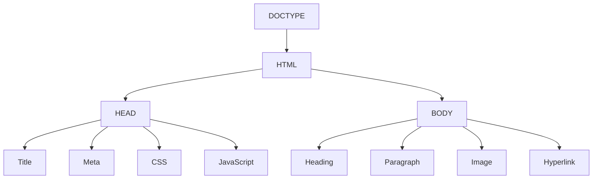

# 🌐 HTML Basics – The Foundation of Every Web Page

> **📄 Suggested File Name:** `01_HTML_Basics.md`

<p align="center">


</p>

---

# 📚 Table of Contents

- [📖 Overview](#-overview)
- [🎯 Learning Objectives](#-learning-objectives)
- [🧠 Prerequisites](#-prerequisites)
- [🌍 What is HTML?](#-what-is-html)
- [🏗 Structure of an HTML Document](#-structure-of-an-html-document)
- [🧩 Common HTML Elements](#-common-html-elements)
- [🏷 HTML Attributes](#-html-attributes)
- [📝 Semantic vs Non-Semantic Tags](#-semantic-vs-non-semantic-tags)
- [💻 Complete HTML Example](#-complete-html-example)
- [📊 Mermaid Diagram](#-mermaid-diagram)
- [⚠ Common Mistakes](#-common-mistakes)
- [✅ Best Practices](#-best-practices)
- [🎤 Interview Questions](#-interview-questions)
- [📝 Practice Questions](#-practice-questions)
- [❓ MCQs](#-mcqs)
- [📌 Cheat Sheet](#-cheat-sheet)
- [⚡ Quick Revision](#-quick-revision)
- [📖 Summary](#-summary)
- [📚 References](#-references)

---

# 📖 Overview

HTML (**HyperText Markup Language**) is the **standard markup language** used to create and structure web pages.

Think of a website like building a house.

| Technology | Purpose | Real-Life Example |
|------------|----------|------------------|
| 🏗 HTML | Structure | Walls, Doors, Roof |
| 🎨 CSS | Design | Paint, Furniture |
| ⚙ JavaScript | Functionality | Lights, Fan, Automatic Door |

> 💡 **Memory Trick**
>
> **HTML = Skeleton**
>
> **CSS = Skin & Clothes**
>
> **JavaScript = Brain & Muscles**

---

# 🎯 Learning Objectives

After completing this lesson, you will be able to:

- ✅ Understand what HTML is.
- ✅ Understand the structure of an HTML document.
- ✅ Use common HTML elements.
- ✅ Understand HTML attributes.
- ✅ Differentiate between semantic and non-semantic tags.
- ✅ Create your first HTML webpage.

---

# 🧠 Prerequisites

- Basic computer knowledge
- VS Code (Recommended)
- Web Browser (Chrome / Edge / Firefox)

---

# 🌍 What is HTML?

## Definition

HTML stands for

> **HyperText Markup Language**

It is used to create the **structure** of web pages.

### Why is it called HyperText?

HyperText means text that contains links to other pages.

Example

```
Home → About → Contact
```

Clicking one page takes you to another.

---

### Why is it called Markup Language?

Because HTML uses **tags** to mark different parts of the content.

Example

```html
<p>Hello World</p>
```

Here,

`<p>` tells the browser

> "This text is a paragraph."

---

## Is HTML a Programming Language?

❌ **No**

HTML cannot

- Perform calculations
- Store variables
- Make decisions
- Use loops
- Execute logic

It simply tells the browser **what content exists**.

---

# 🌐 How Does HTML Work?

```
Developer
      │
      ▼
Writes HTML
      │
      ▼
Browser Reads HTML
      │
      ▼
Browser Builds Webpage
      │
      ▼
User Sees Website
```

---

# 🏗 Structure of an HTML Document

Every HTML page follows this structure.

```html
<!DOCTYPE html>
<html>

<head>

    <title>My First Website</title>

</head>

<body>

    <h1>Hello World</h1>

    <p>Welcome to HTML</p>

</body>

</html>
```

---

## Visual Structure

```
HTML Document
│
├── <!DOCTYPE html>
│
└── <html>
      │
      ├── <head>
      │      ├── title
      │      ├── meta
      │      ├── link
      │      └── script
      │
      └── <body>
             ├── Heading
             ├── Paragraph
             ├── Image
             ├── Link
             └── Button
```

---

# 🔹 `<!DOCTYPE html>`

## Definition

Declares that the webpage uses **HTML5**.

```html
<!DOCTYPE html>
```

### Purpose

- Tells the browser to use HTML5.
- Prevents Compatibility Mode.
- Ensures modern browser behavior.

> 💡 Think of it like writing the subject name on an exam paper before answering questions.

---

# 🔹 `<html>`

The **root element**.

Everything (except DOCTYPE) is placed inside it.

```html
<html>

...

</html>
```

---

# 🔹 `<head>`

Contains information **about the webpage**, not the visible content.

### Common Elements

| Tag | Purpose |
|------|----------|
| `<title>` | Browser tab title |
| `<meta>` | Metadata |
| `<link>` | CSS file |
| `<script>` | JavaScript |
| `<style>` | Internal CSS |

Example

```html
<head>

<title>HTML Basics</title>

<meta charset="UTF-8">

<link rel="stylesheet" href="style.css">

<script src="script.js"></script>

</head>
```

> 💡 **Remember**
>
> Users **do not see** the contents inside `<head>` (except the page title in the browser tab).

---

# 🔹 `<body>`

Contains everything visible on the webpage.

Examples include

- Headings
- Paragraphs
- Images
- Videos
- Buttons
- Tables
- Forms

Example

```html
<body>

<h1>Welcome</h1>

<p>Hello Everyone!</p>

</body>
```

---

# 🧩 Common HTML Elements

## 📌 Heading Tags

Used to create titles and headings.

```html
<h1>Main Heading</h1>

<h2>Heading 2</h2>

<h3>Heading 3</h3>

<h4>Heading 4</h4>

<h5>Heading 5</h5>

<h6>Heading 6</h6>
```

### Importance

| Tag | Usage |
|------|-------|
| `<h1>` | Main Title |
| `<h2>` | Section |
| `<h3>` | Subsection |
| `<h4>` | Subtopic |
| `<h5>` | Small Heading |
| `<h6>` | Smallest Heading |

> ✅ Best Practice: Use only **one `<h1>`** per page.

---

## 📌 Paragraph

```html
<p>This is a paragraph.</p>
```

Used for blocks of text.

---

## 📌 Hyperlink

```html
<a href="https://www.google.com">

Google

</a>
```

The `<a>` tag stands for **Anchor**.

---

## 📌 Image

```html

```

`` is a **void element**.

It has **no closing tag**.

---

# 🏷 HTML Attributes

Attributes provide **extra information** about HTML elements.

### Syntax

```html
attribute="value"
```

Example

```html
<a href="https://google.com">

Google

</a>
```

---

## 📌 href

Used inside

```html
<a>
```

Purpose

Specifies where the hyperlink goes.

Example

```html
<a href="https://github.com">

GitHub

</a>
```

---

## 📌 src

Used inside

```html

```

Purpose

Specifies the image location.

Example

```html

```

---

## 📌 alt

Alternative text.

Example

```html

```

### Why is it important?

✅ Accessibility

✅ SEO

✅ Shows text if image fails to load

---

## 📌 title

Displays a tooltip.

Example

```html
<p title="This is a paragraph">

Hover Here

</p>
```

---

# 📝 Semantic vs Non-Semantic Tags

## 📖 What are Semantic Tags?

Semantic tags describe **the meaning** of the content.

Examples

```html
<header>

<nav>

<main>

<section>

<article>

<aside>

<footer>
```

### Benefits

- Better SEO
- Better Accessibility
- Easier Maintenance
- Easy to Read

---

## 📖 What are Non-Semantic Tags?

These tags do **not** describe their content.

Examples

```html
<div>

<span>
```

They are simply generic containers.

---

# 📊 Comparison

| Feature | Semantic | Non-Semantic |
|----------|----------|--------------|
| Meaning | ✅ Yes | ❌ No |
| SEO | ⭐⭐⭐⭐⭐ | ⭐⭐ |
| Accessibility | ⭐⭐⭐⭐⭐ | ⭐⭐ |
| Readability | ⭐⭐⭐⭐⭐ | ⭐⭐ |
| Examples | `<header>` `<section>` | `<div>` `<span>` |

---

# 💻 Complete HTML Example

```html
<!DOCTYPE html>
<html>

<head>

<meta charset="UTF-8">

<title>HTML Basics</title>

</head>

<body>

<header>

<h1>Learning HTML</h1>

</header>

<main>

<section>

<h2>Introduction</h2>

<p>HTML is the foundation of every webpage.</p>

<a href="https://developer.mozilla.org">

Learn HTML

</a>

<br>


</section>

</main>

<footer>

<p>Copyright © 2026</p>

</footer>

</body>

</html>
```

---

# 📊 Mermaid Diagram



---

# ⚠ Common Mistakes

❌ Forgetting `<!DOCTYPE html>`

❌ Missing closing tags

❌ Putting visible content inside `<head>`

❌ Forgetting `alt` for images

❌ Using too many `<div>` elements instead of semantic tags

❌ Using multiple `<h1>` tags unnecessarily

---

# ✅ Best Practices

- ✅ Always use HTML5 (`<!DOCTYPE html>`)
- ✅ Write clean indentation
- ✅ Use semantic HTML
- ✅ Add `alt` to every image
- ✅ Keep only one `<h1>`
- ✅ Organize content with headings
- ✅ Validate HTML before publishing

---

# 🎤 Interview Questions

## Beginner

1. What is HTML?
2. Is HTML a programming language?
3. Why is HTML called a Markup Language?
4. What is the purpose of `<!DOCTYPE html>`?

---

## Intermediate

5. Difference between `<head>` and `<body>`?

6. Explain HTML attributes.

7. Difference between `href` and `src`.

8. Why is `alt` important?

---

## Advanced

9. Why should semantic HTML be preferred?

10. Explain how browsers render HTML.

---

# 📝 Practice Questions

### 🟢 Easy

- Create a webpage with one heading and one paragraph.
- Add an image.
- Create a hyperlink.

---

### 🟡 Medium

- Create a webpage using semantic tags.
- Use `href`, `src`, `alt`, and `title`.

---

### 🔴 Hard

Create a webpage containing

- Header
- Navigation
- About
- Services
- Contact
- Footer

using only semantic tags.

---

# ❓ MCQs

### 1. HTML stands for

- A. HyperText Markup Language ✅
- B. Hyper Tool Markup Language
- C. Home Text Machine Language
- D. HighText Markup Language

---

### 2. Which tag contains webpage content?

- A. `<head>`
- B. `<title>`
- C. `<body>` ✅
- D. `<meta>`

---

### 3. Which attribute specifies image location?

- A. href
- B. src ✅
- C. alt
- D. title

---

### 4. Which is semantic?

- A. `<div>`
- B. `<span>`
- C. `<header>` ✅
- D. `<font>`

---

# 📌 Cheat Sheet

| Tag | Purpose |
|------|----------|
| `<!DOCTYPE html>` | HTML5 Declaration |
| `<html>` | Root Element |
| `<head>` | Metadata |
| `<body>` | Visible Content |
| `<h1>` | Main Heading |
| `<p>` | Paragraph |
| `<a>` | Hyperlink |
| `` | Image |
| `href` | Link Destination |
| `src` | Resource Path |
| `alt` | Alternative Text |
| `title` | Tooltip |

---

# ⚡ Quick Revision

```text
🏗 HTML → Structure

🎨 CSS → Design

⚙ JavaScript → Functionality

📄 DOCTYPE → HTML5

🌍 html → Root Element

🧠 head → Metadata

👀 body → Visible Content

🔗 href → Hyperlink

🖼 src → Image Source

♿ alt → Accessibility

💬 title → Tooltip

📚 Semantic → Meaningful Tags

📦 Non-Semantic → Generic Containers
```

---

# 📖 Summary

HTML is the backbone of every website. It provides the structure that browsers use to display content. Every HTML document begins with `<!DOCTYPE html>` and is organized into the `<html>`, `<head>`, and `<body>` sections. Common elements such as headings, paragraphs, links, and images form the visible content, while attributes like `href`, `src`, `alt`, and `title` add additional information and functionality. Using semantic tags improves readability, accessibility, and SEO, making your code cleaner and easier to maintain.

---

# 📚 References

- https://developer.mozilla.org/en-US/docs/Web/HTML
- https://html.spec.whatwg.org/
- https://www.w3schools.com/html/
- https://validator.w3.org/
