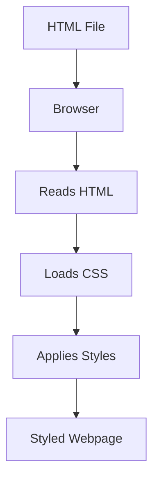

# 🎨 Introduction to CSS (Cascading Style Sheets)

> **📄 Suggested File Name:** `02_Introduction_to_CSS.md`

<p align="center">


</p>

---

# 📚 Table of Contents

- 📖 Overview
- 🎯 Learning Objectives
- 🧠 Prerequisites
- 🌍 What is CSS?
- 🤝 How CSS Works with HTML
- 🎨 Ways to Apply CSS
- 📝 CSS Syntax
- 🎯 CSS Selectors
- 🏷 CSS Properties & Values
- 💻 Complete Example
- 📊 Mermaid Diagram
- ⚠ Common Mistakes
- ✅ Best Practices
- 🎤 Interview Questions
- 📝 Practice Questions
- ❓ MCQs
- 📌 Cheat Sheet
- ⚡ Quick Revision
- 📖 Summary
- 📚 References

---

# 📖 Overview

CSS (**Cascading Style Sheets**) is the language used to **style and design HTML web pages**.

HTML creates the **structure**, while CSS controls the **appearance**.

Without CSS, websites would look plain with only text and images.

---

# 🎯 Learning Objectives

After completing this lesson, you will be able to:

- ✅ Understand what CSS is.
- ✅ Explain how CSS works with HTML.
- ✅ Apply CSS using different methods.
- ✅ Understand CSS syntax.
- ✅ Write simple CSS rules.

---

# 🧠 Prerequisites

- Basic knowledge of HTML
- Familiarity with HTML tags and attributes
- VS Code or any text editor
- Web browser

---

# 🌍 What is CSS?

**CSS** stands for **Cascading Style Sheets**.

It is a stylesheet language used to control the **presentation** of HTML elements.

CSS allows you to change:

- 🎨 Colors
- 🔤 Fonts
- 📏 Sizes
- 📍 Position
- 📦 Layout
- ✨ Animations
- 📱 Responsive design

---

## 🏠 Real-World Analogy

Imagine building a house.

| Technology | Purpose | Example |
|------------|----------|----------|
| 🏗 HTML | Structure | Walls, Doors, Roof |
| 🎨 CSS | Appearance | Paint, Furniture, Decorations |
| ⚙ JavaScript | Functionality | Lights, Fans, Smart Lock |

---

## 🧠 Memory Trick

> **HTML builds the house.**
>
> **CSS paints and decorates the house.**
>
> **JavaScript makes the house smart.**

---

# 🤝 How CSS Works with HTML

HTML provides the content.

Example

```html
<h1>Welcome</h1>

<p>This is my website.</p>
```

Without CSS

```
Welcome

This is my website.
```

Now add CSS.

```css
h1{
    color: blue;
}

p{
    color: gray;
}
```

Browser Output

```
Welcome        ← Blue

This is my website. ← Gray
```

CSS tells the browser **how HTML elements should look.**

---

## 🔄 How CSS is Applied

```
HTML File
     │
     ▼
Browser Reads HTML
     │
     ▼
Browser Finds CSS
     │
     ▼
CSS Styles HTML Elements
     │
     ▼
Beautiful Webpage
```

---

# 🎨 Ways to Apply CSS

There are **three ways** to apply CSS.

1. Inline CSS
2. Internal CSS
3. External CSS

---

# 1️⃣ Inline CSS

CSS is written directly inside an HTML element using the **style** attribute.

### Syntax

```html
<h1 style="color:red;">
Welcome
</h1>
```

### Output

The heading appears in **red**.

### Advantages

- Quick styling
- Useful for testing

### Disadvantages

- Difficult to maintain
- Not reusable
- Makes HTML messy

---

# 2️⃣ Internal CSS

CSS is written inside the `<style>` tag within the `<head>` section.

### Example

```html
<!DOCTYPE html>

<html>

<head>

<style>

h1{
    color:blue;
}

p{
    color:green;
}

</style>

</head>

<body>

<h1>Hello</h1>

<p>Welcome</p>

</body>

</html>
```

### Advantages

- Suitable for single-page websites
- Keeps CSS separate from HTML elements

### Disadvantages

- Cannot be reused across multiple pages

---

# 3️⃣ External CSS ⭐ (Recommended)

CSS is written in a separate `.css` file.

Example

### index.html

```html
<link rel="stylesheet" href="style.css">
```

### style.css

```css
h1{
    color:blue;
}

p{
    color:gray;
}
```

### Advantages

- Reusable
- Easy to maintain
- Faster website loading due to browser caching
- Best practice for real projects

---

# 📊 Comparison

| Feature | Inline | Internal | External |
|----------|---------|----------|----------|
| Separate File | ❌ | ❌ | ✅ |
| Reusable | ❌ | ❌ | ✅ |
| Easy Maintenance | ❌ | ⭐⭐ | ⭐⭐⭐⭐⭐ |
| Recommended | ❌ | ⭐⭐⭐ | ✅ |

---

# 📝 CSS Syntax

A CSS rule consists of:

- Selector
- Property
- Value

### Syntax

```css
selector{
    property: value;
}
```

Example

```css
h1{
    color: blue;
}
```

---

## 🔍 Parts of a CSS Rule

```css
h1{
    color: blue;
}
```

| Part | Description |
|------|-------------|
| `h1` | Selector |
| `color` | Property |
| `blue` | Value |

---

## 📌 Visual Representation

```
Selector
   │
   ▼
h1
{
   color : blue;
   │        │
Property   Value
}
```

---

# 🎯 CSS Selectors

Selectors tell CSS **which HTML element** to style.

### Element Selector

```css
p{
    color:red;
}
```

Styles **all paragraphs**.

---

### ID Selector

HTML

```html
<h1 id="title">
Welcome
</h1>
```

CSS

```css
#title{
    color:blue;
}
```

Uses `#`.

---

### Class Selector

HTML

```html
<p class="text">
Hello
</p>
```

CSS

```css
.text{
    color:green;
}
```

Uses `.`

---

## 📊 Selector Comparison

| Selector | Symbol | Example |
|----------|--------|---------|
| Element | None | `p` |
| Class | `.` | `.menu` |
| ID | `#` | `#header` |

---

# 🏷 CSS Properties & Values

Properties define **what** to style.

Values define **how** to style.

Example

```css
p{

color:red;

font-size:20px;

background-color:yellow;

text-align:center;

}
```

---

## Common CSS Properties

| Property | Purpose |
|-----------|----------|
| color | Text color |
| background-color | Background color |
| font-size | Text size |
| font-family | Font style |
| text-align | Text alignment |
| width | Element width |
| height | Element height |
| margin | Outside spacing |
| padding | Inside spacing |
| border | Border around element |

---

# 💻 Complete Example

### index.html

```html
<!DOCTYPE html>

<html>

<head>

<title>CSS Example</title>

<link rel="stylesheet" href="style.css">

</head>

<body>

<h1 id="heading">

Learning CSS

</h1>

<p class="text">

CSS makes webpages beautiful.

</p>

</body>

</html>
```

---

### style.css

```css
#heading{

color:blue;

text-align:center;

}

.text{

color:green;

font-size:20px;

}
```

---

# 📊 Mermaid Diagram



---

# ⚠ Common Mistakes

- ❌ Forgetting to link the external CSS file.
- ❌ Missing semicolons (`;`) after property values.
- ❌ Misspelling property names.
- ❌ Using `id` multiple times on one page.
- ❌ Forgetting the `.` for class selectors or `#` for ID selectors.
- ❌ Writing CSS outside the `<style>` tag or `.css` file.

---

# ✅ Best Practices

- Use **External CSS** for most projects.
- Keep HTML and CSS separate.
- Use meaningful class names.
- Write properly indented CSS.
- Avoid excessive inline styles.
- Group related styles together.
- Comment your CSS for better readability.

---

# 🎤 Interview Questions

### Beginner

1. What is CSS?
2. Why do we use CSS?
3. What are the three ways to apply CSS?
4. Which method is recommended?

---

### Intermediate

5. Explain CSS syntax.
6. What is a selector?
7. Difference between class and ID selectors?
8. What is the difference between a property and a value?

---

### Advanced

9. Why is External CSS preferred?
10. How does the browser apply CSS to HTML?

---

# 📝 Practice Questions

### 🟢 Easy

- Change the text color of a heading.
- Create an internal CSS example.
- Apply inline CSS to a paragraph.

---

### 🟡 Medium

- Create an external CSS file.
- Style headings and paragraphs using class selectors.
- Change background color and font size.

---

### 🔴 Hard

Create a webpage with:

- External CSS
- Multiple headings
- Paragraphs
- Class selectors
- ID selectors
- Different text colors
- Background colors
- Center-aligned content

---

# ❓ MCQs

### 1. CSS stands for

- A. Cascading Style Sheets ✅
- B. Computer Style Sheets
- C. Creative Style System
- D. Color Style Sheets

---

### 2. Which method is recommended for large websites?

- A. Inline CSS
- B. Internal CSS
- C. External CSS ✅
- D. Embedded CSS

---

### 3. Which symbol represents a class selector?

- A. `#`
- B. `. ` ✅
- C. `*`
- D. `@`

---

### 4. Which symbol represents an ID selector?

- A. `.`
- B. `#` ✅
- C. `$`
- D. `&`

---

# 📌 Cheat Sheet

| Concept | Syntax |
|----------|--------|
| Inline CSS | `style=""` |
| Internal CSS | `<style>` |
| External CSS | `<link>` |
| Element Selector | `p` |
| Class Selector | `.class` |
| ID Selector | `#id` |
| Property | `color` |
| Value | `blue` |

---

# ⚡ Quick Revision

```text
🎨 CSS → Styling Language

🏗 HTML → Structure

🎨 CSS → Appearance

📌 Inline → style attribute

📌 Internal → style tag

📌 External → CSS file

🎯 Selector → Selects HTML elements

🏷 Property → What to change

✨ Value → New style

. → Class Selector

# → ID Selector
```

---

# 📖 Summary

CSS is the language responsible for designing and styling HTML webpages. It works alongside HTML by controlling colors, fonts, layouts, spacing, and many other visual aspects. CSS can be applied using inline, internal, or external methods, with external CSS being the most recommended because it is reusable, maintainable, and suitable for large projects. Understanding selectors, properties, and values is the foundation for writing effective CSS.

---

# 📚 References

- https://developer.mozilla.org/en-US/docs/Web/CSS
- https://www.w3.org/Style/CSS/
- https://www.w3schools.com/css/
- https://css-tricks.com/
- https://developer.mozilla.org/en-US/docs/Learn/CSS
