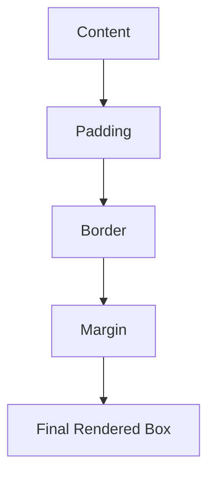
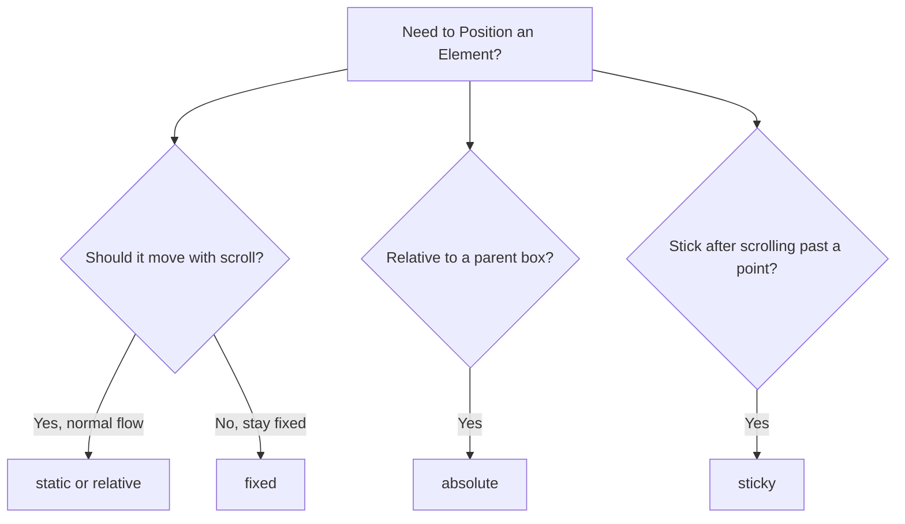

# 🎨 Styling and Layout with CSS

> **📄 Suggested File Name:** `03_Styling_and_Layout_with_CSS.md`

<p align="center">


</p>

---

# 📚 Table of Contents

- 📖 Overview
- 🎯 Learning Objectives
- 🧠 Prerequisites
- 🎨 Colors, Fonts & Text Styling
- 📦 The Box Model
- 🧩 Display Properties
- 📍 Positioning
- 💻 Complete Example
- 📊 Mermaid Diagrams
- ⚠ Common Mistakes
- ✅ Best Practices
- 🎤 Interview Questions
- 📝 Practice Questions
- ❓ MCQs
- 📌 Cheat Sheet
- ⚡ Quick Revision
- 📖 Summary
- 📚 References

---

# 📖 Overview

Once you know **what** CSS is and **how** to apply it, the next step is learning **how elements are styled and arranged** on a page.

This lesson covers four core pillars of CSS layout and styling:

- 🎨 **Colors, fonts, and text styling** — how content looks
- 📦 **Box model** — how space around and inside elements works
- 🧩 **Display properties** — how elements behave in the flow of a page
- 📍 **Positioning** — how elements can be moved and layered

---

# 🎯 Learning Objectives

After completing this lesson, you will be able to:

- ✅ Style text using colors, fonts, and text properties.
- ✅ Understand and apply the CSS box model.
- ✅ Differentiate between `block`, `inline`, `inline-block`, and `none`.
- ✅ Use `static`, `relative`, `absolute`, `fixed`, and `sticky` positioning.
- ✅ Build a simple styled and positioned layout.

---

# 🧠 Prerequisites

- Basic knowledge of HTML
- Understanding of CSS syntax and selectors (Inline / Internal / External CSS)
- VS Code or any text editor
- Web browser

---

# 🎨 Colors, Fonts & Text Styling

CSS gives you full control over how **text and content** look.

---

## 🎨 Colors

Colors can be set using keywords, HEX, RGB, or HSL.

```css
h1{
    color: red;
}

p{
    color: #333333;
}

div{
    background-color: rgb(240, 240, 240);
}

span{
    color: hsl(200, 100%, 50%);
}
```

| Format | Example | Notes |
|--------|----------|-------|
| Keyword | `red`, `blue` | Simple, limited options |
| HEX | `#ff0000` | Most common |
| RGB | `rgb(255,0,0)` | Good for opacity control |
| RGBA | `rgba(255,0,0,0.5)` | Adds transparency |
| HSL | `hsl(0,100%,50%)` | Easy to adjust lightness |

---

## 🔤 Fonts

```css
p{
    font-family: Arial, sans-serif;
    font-size: 18px;
    font-weight: bold;
    font-style: italic;
}
```

| Property | Purpose |
|-----------|----------|
| font-family | Font type |
| font-size | Text size |
| font-weight | Boldness (normal, bold, 100–900) |
| font-style | Normal, italic, oblique |

---

## 📝 Text Styling

```css
p{
    text-align: center;
    text-decoration: underline;
    text-transform: uppercase;
    line-height: 1.6;
    letter-spacing: 1px;
}
```

| Property | Purpose |
|-----------|----------|
| text-align | left, right, center, justify |
| text-decoration | underline, line-through, none |
| text-transform | uppercase, lowercase, capitalize |
| line-height | Space between lines |
| letter-spacing | Space between letters |

---

# 📦 The Box Model

Every HTML element is treated as a **rectangular box**.

The box model defines how much space that box takes up, made of four layers:

```
┌───────────────────────────────┐
│           Margin               │
│  ┌───────────────────────────┐ │
│  │         Border             │ │
│  │  ┌───────────────────────┐ │ │
│  │  │       Padding          │ │ │
│  │  │  ┌──────────────────┐ │ │ │
│  │  │  │     Content       │ │ │ │
│  │  │  └──────────────────┘ │ │ │
│  │  └───────────────────────┘ │ │
│  └───────────────────────────┘ │
└───────────────────────────────┘
```

| Layer | Description |
|--------|-------------|
| Content | The actual text/image inside the element |
| Padding | Space between content and border |
| Border | Line surrounding the padding |
| Margin | Space outside the border, between elements |

---

## 💻 Box Model Example

```css
div{
    width: 200px;
    height: 100px;
    padding: 20px;
    border: 2px solid black;
    margin: 15px;
}
```

### Total Width Calculation (default `box-sizing`)

```
Total Width = width + left padding + right padding + left border + right border + left margin + right margin

= 200 + 20 + 20 + 2 + 2 + 15 + 15
= 274px
```

---

## 📦 box-sizing Property

```css
div{
    box-sizing: border-box;
}
```

| Value | Behavior |
|--------|----------|
| content-box (default) | Width/height apply to content only |
| border-box | Width/height include padding and border |

> **Tip:** `border-box` makes layout math much easier and is widely recommended.

---

# 🧩 Display Properties

The `display` property controls **how an element behaves** in the page layout.

---

## 1️⃣ block

- Takes up the **full width** available.
- Starts on a **new line**.
- Examples: `<div>`, `<p>`, `<h1>`, `<section>`

```css
div{
    display: block;
}
```

---

## 2️⃣ inline

- Takes up **only as much width as needed**.
- Does **not** start on a new line.
- Cannot have width/height applied.
- Examples: `<span>`, `<a>`, `<strong>`

```css
span{
    display: inline;
}
```

---

## 3️⃣ inline-block

- Behaves like `inline` (sits in a line with others) **but** allows width/height/padding/margin like `block`.

```css
span{
    display: inline-block;
    width: 100px;
    height: 40px;
}
```

---

## 4️⃣ none

- **Completely removes** the element from the page.
- Element takes up no space at all (different from `visibility: hidden`, which hides it but keeps its space).

```css
div{
    display: none;
}
```

---

## 📊 Display Comparison

| Property | New Line? | Width/Height Works? | Takes Space if Hidden? |
|-----------|-----------|----------------------|--------------------------|
| block | ✅ | ✅ | — |
| inline | ❌ | ❌ | — |
| inline-block | ❌ | ✅ | — |
| none | N/A | N/A | ❌ (removed entirely) |

---

# 📍 Positioning

The `position` property controls **where an element is placed**, often combined with `top`, `right`, `bottom`, `left`.

---

## 1️⃣ static (default)

- Normal flow of the page.
- `top`, `left`, etc. have **no effect**.

```css
div{
    position: static;
}
```

---

## 2️⃣ relative

- Positioned **relative to its normal position**.
- Moving it does **not** affect surrounding elements — it leaves a gap behind.

```css
div{
    position: relative;
    top: 10px;
    left: 20px;
}
```

---

## 3️⃣ absolute

- Positioned **relative to the nearest positioned ancestor** (an ancestor with `position` other than `static`). If none exists, it's relative to the `<html>` page.
- Removed from normal document flow — other elements ignore it.

```css
.parent{
    position: relative;
}

.child{
    position: absolute;
    top: 0;
    right: 0;
}
```

---

## 4️⃣ fixed

- Positioned **relative to the browser window**.
- Stays in place even when the page is scrolled.
- Common use: sticky navbars, "back to top" buttons.

```css
.navbar{
    position: fixed;
    top: 0;
    width: 100%;
}
```

---

## 5️⃣ sticky

- A hybrid of `relative` and `fixed`.
- Behaves like `relative` until the scroll reaches a defined point, then "sticks" like `fixed`.

```css
.header{
    position: sticky;
    top: 0;
}
```

---

## 📊 Positioning Comparison

| Value | Relative To | Removed from Flow? | Scrolls with Page? |
|--------|--------------|----------------------|----------------------|
| static | Normal flow | ❌ | ✅ |
| relative | Its own original position | ❌ | ✅ |
| absolute | Nearest positioned ancestor | ✅ | ✅ (with ancestor) |
| fixed | Browser viewport | ✅ | ❌ |
| sticky | Scroll container | ❌ (until threshold) | Switches to fixed-like |

---

# 💻 Complete Example

### index.html

```html
<!DOCTYPE html>

<html>

<head>

<title>Styling and Layout</title>

<link rel="stylesheet" href="style.css">

</head>

<body>

<div class="navbar">Sticky Navbar</div>

<div class="box">

<p class="text">Styled Box</p>

</div>

</body>

</html>
```

---

### style.css

```css
.navbar{
    position: fixed;
    top: 0;
    width: 100%;
    background-color: #1572B6;
    color: white;
    padding: 10px;
    text-align: center;
}

.box{
    width: 200px;
    height: 100px;
    margin: 60px auto 0 auto;
    padding: 20px;
    border: 2px solid #333;
    box-sizing: border-box;
    display: block;
    position: relative;
}

.text{
    font-family: Arial, sans-serif;
    font-size: 18px;
    font-weight: bold;
    color: #1572B6;
    text-align: center;
}
```

---

# 📊 Mermaid Diagrams

### Box Model Flow



### Positioning Decision Flow



---

# ⚠ Common Mistakes

- ❌ Forgetting `position: relative` on the parent when using `absolute` on a child.
- ❌ Confusing `display: none` with `visibility: hidden`.
- ❌ Not accounting for padding/border/margin when calculating total element width.
- ❌ Applying `width`/`height` to an `inline` element and expecting it to work.
- ❌ Using `fixed` positioning without testing on smaller screens (can overlap content).
- ❌ Forgetting `box-sizing: border-box` and getting unexpected layout sizes.

---

# ✅ Best Practices

- Use `box-sizing: border-box` globally for predictable sizing.
- Prefer `inline-block` or modern layout tools (Flexbox/Grid) over overusing `absolute` positioning.
- Use `relative` on a parent container before using `absolute` on children.
- Use `sticky` for headers/navbars instead of `fixed` when you want it to respect normal flow initially.
- Keep font and color choices consistent using reusable classes.
- Test layouts across different screen sizes.

---

# 🎤 Interview Questions

### Beginner

1. What is the CSS box model?
2. What is the difference between `padding` and `margin`?
3. What does `display: none` do?
4. What is the default value of `position`?

---

### Intermediate

5. Explain the difference between `block`, `inline`, and `inline-block`.
6. How does `position: absolute` determine its reference point?
7. What is the difference between `relative` and `fixed` positioning?
8. What does `box-sizing: border-box` change?

---

### Advanced

9. How does `position: sticky` differ from both `relative` and `fixed`?
10. Why might overusing `absolute` positioning make a layout hard to maintain?

---

# 📝 Practice Questions

### 🟢 Easy

- Change the font size and color of a paragraph.
- Add padding and margin to a `div`.
- Hide an element using `display: none`.

---

### 🟡 Medium

- Create a box using the box model with padding, border, and margin, and calculate its total width.
- Create three elements using `block`, `inline`, and `inline-block` and observe the difference.
- Position an element using `relative` and offset it with `top`/`left`.

---

### 🔴 Hard

Create a webpage with:

- A `fixed` navbar at the top
- A `sticky` section header
- A card with `position: relative` containing a badge with `position: absolute`
- Consistent font and color styling
- Correct use of `box-sizing: border-box`

---

# ❓ MCQs

### 1. Which property controls space *outside* an element's border?

- A. padding
- B. margin ✅
- C. border
- D. outline

---

### 2. Which display value removes an element from the page entirely, including its space?

- A. inline
- B. block
- C. none ✅
- D. inline-block

---

### 3. Which position value is relative to the nearest positioned ancestor?

- A. static
- B. relative
- C. absolute ✅
- D. fixed

---

### 4. Which position value stays fixed relative to the browser window even while scrolling?

- A. relative
- B. sticky
- C. static
- D. fixed ✅

---

### 5. Which box-sizing value includes padding and border within the specified width?

- A. content-box
- B. border-box ✅
- C. padding-box
- D. inherit

---

# 📌 Cheat Sheet

| Concept | Syntax |
|----------|--------|
| Text color | `color: value;` |
| Background color | `background-color: value;` |
| Font family | `font-family: value;` |
| Font size | `font-size: value;` |
| Padding | `padding: value;` |
| Margin | `margin: value;` |
| Border | `border: width style color;` |
| Box sizing | `box-sizing: border-box;` |
| Block display | `display: block;` |
| Inline display | `display: inline;` |
| Inline-block display | `display: inline-block;` |
| Hide element | `display: none;` |
| Static position | `position: static;` |
| Relative position | `position: relative;` |
| Absolute position | `position: absolute;` |
| Fixed position | `position: fixed;` |
| Sticky position | `position: sticky;` |

---

# ⚡ Quick Revision

```text
🎨 Colors → keyword, HEX, RGB, RGBA, HSL

🔤 Fonts → font-family, font-size, font-weight, font-style

📝 Text → text-align, text-decoration, text-transform, line-height

📦 Box Model → Content → Padding → Border → Margin

📦 box-sizing → content-box (default) vs border-box

🧩 Display → block (new line), inline (no width/height), inline-block (both), none (removed)

📍 Position → static (default), relative (offset from self), absolute (from positioned ancestor), fixed (viewport), sticky (hybrid)
```

---

# 📖 Summary

Styling and layout in CSS build on the basics by giving you precise control over how content looks and how elements occupy space on a page. Colors, fonts, and text properties shape the visual appearance of content, while the box model (content, padding, border, margin) defines how much space each element takes up. Display properties (`block`, `inline`, `inline-block`, `none`) determine how elements behave in the flow of the page, and positioning (`static`, `relative`, `absolute`, `fixed`, `sticky`) determines exactly where elements appear, whether they move with scrolling, and how they relate to other elements. Mastering these four areas is the foundation for building real, well-structured web layouts.

---

# 📚 References

- https://developer.mozilla.org/en-US/docs/Web/CSS/CSS_box_model
- https://developer.mozilla.org/en-US/docs/Web/CSS/display
- https://developer.mozilla.org/en-US/docs/Web/CSS/position
- https://www.w3schools.com/css/css_boxmodel.asp
- https://css-tricks.com/almanac/properties/p/position/
