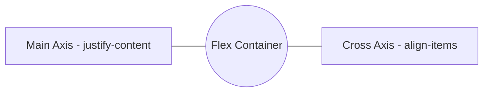
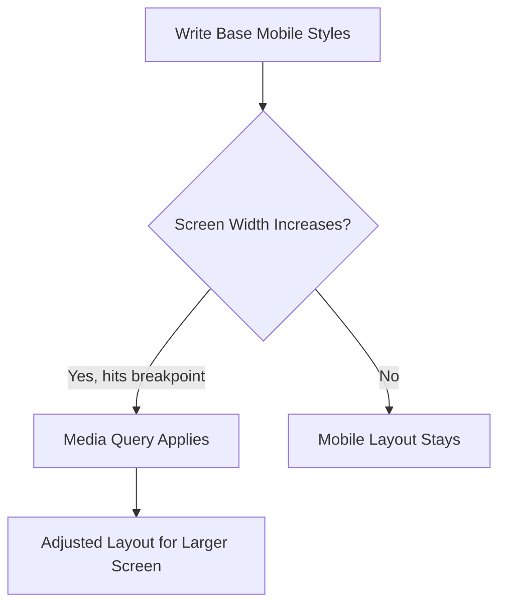

# 📐 Layout Systems and Responsiveness

> **📄 Suggested File Name:** `04_Layout_Systems_and_Responsiveness.md`

<p align="center">


</p>

---

# 📚 Table of Contents

- 📖 Overview
- 🎯 Learning Objectives
- 🧠 Prerequisites
- 🧵 Flexbox Fundamentals
- 🧮 Grid Basics
- 📱 Responsive Design Concepts
- 🔍 Media Queries
- 💻 Complete Example
- 📊 Mermaid Diagrams
- ⚠ Common Mistakes
- ✅ Best Practices
- 🎤 Interview Questions
- 📝 Practice Questions
- ❓ MCQs
- 📌 Cheat Sheet
- ⚡ Quick Revision
- 📖 Summary
- 📚 References

---

# 📖 Overview

Once you understand the box model, display, and positioning, the next step is learning how to build **real layouts** that adapt to any screen.

This lesson covers:

- 🧵 **Flexbox** — one-dimensional layout for rows or columns
- 🧮 **Grid** — two-dimensional layout for rows *and* columns together
- 📱 **Responsive design** — designing for many screen sizes
- 🔍 **Media queries** — the tool that makes responsiveness possible

---

# 🎯 Learning Objectives

After completing this lesson, you will be able to:

- ✅ Create a flex container and align its items.
- ✅ Build a basic grid layout using rows, columns, and gaps.
- ✅ Explain the core principles of responsive design.
- ✅ Write media queries to adapt layouts to different screen sizes.

---

# 🧠 Prerequisites

- Understanding of CSS box model, display, and positioning
- Basic HTML structure knowledge
- VS Code or any text editor
- Web browser

---

# 🧵 Flexbox Fundamentals

**Flexbox (Flexible Box Layout)** arranges items in a single direction — a row or a column — and makes alignment and spacing easy.

---

## 🧵 The Flex Container

Any element becomes a flex container by setting `display: flex`.

```css
.container{
    display: flex;
}
```

All **direct children** of the container automatically become **flex items**.

---

## ➡ flex-direction

Controls the main axis direction.

```css
.container{
    display: flex;
    flex-direction: row;
}
```

| Value | Direction |
|--------|-----------|
| row (default) | Left to right |
| row-reverse | Right to left |
| column | Top to bottom |
| column-reverse | Bottom to top |

---

## 📐 Alignment Properties

| Property | Applies To | Aligns Along |
|-----------|-------------|----------------|
| justify-content | Container | Main axis |
| align-items | Container | Cross axis |
| align-self | Individual item | Cross axis (overrides align-items) |

```css
.container{
    display: flex;
    justify-content: center;
    align-items: center;
}
```

---

## 📊 justify-content Values

| Value | Behavior |
|--------|-----------|
| flex-start (default) | Items packed at start |
| flex-end | Items packed at end |
| center | Items centered |
| space-between | Equal space between items |
| space-around | Equal space around items |
| space-evenly | Equal space everywhere |

---

## 📊 align-items Values

| Value | Behavior |
|--------|-----------|
| stretch (default) | Items stretch to fill cross axis |
| flex-start | Aligned to top/start |
| flex-end | Aligned to bottom/end |
| center | Centered on cross axis |
| baseline | Aligned by text baseline |

---

## 🔁 flex-wrap

Controls whether items wrap onto new lines.

```css
.container{
    display: flex;
    flex-wrap: wrap;
}
```

| Value | Behavior |
|--------|-----------|
| nowrap (default) | All items on one line, may overflow |
| wrap | Items wrap onto multiple lines |
| wrap-reverse | Wraps in reverse order |

---

## 📦 Flex Item Properties

```css
.item{
    flex-grow: 1;
    flex-shrink: 1;
    flex-basis: 200px;
}
```

| Property | Purpose |
|-----------|----------|
| flex-grow | How much an item grows relative to others |
| flex-shrink | How much an item shrinks if space is tight |
| flex-basis | Starting size before growing/shrinking |
| flex (shorthand) | `flex: grow shrink basis;` |

---

# 🧮 Grid Basics

**CSS Grid** arranges items in **rows and columns at the same time**, making it ideal for full page layouts.

---

## 🧮 The Grid Container

```css
.container{
    display: grid;
    grid-template-columns: 200px 200px 200px;
    grid-template-rows: 100px 100px;
}
```

This creates a **3-column, 2-row** grid.

---

## 📏 Using fr Units

The `fr` unit divides available space proportionally.

```css
.container{
    display: grid;
    grid-template-columns: 1fr 2fr 1fr;
}
```

| Column | Share of Space |
|---------|------------------|
| 1st | 1 part |
| 2nd | 2 parts |
| 3rd | 1 part |

---

## ↔ Gaps

```css
.container{
    display: grid;
    grid-template-columns: repeat(3, 1fr);
    gap: 20px;
}
```

| Property | Purpose |
|-----------|----------|
| gap | Space between rows and columns |
| row-gap | Space between rows only |
| column-gap | Space between columns only |

---

## 🔁 repeat() Function

```css
.container{
    grid-template-columns: repeat(4, 1fr);
}
```

Same as writing `1fr 1fr 1fr 1fr`, but shorter.

---

## 📍 Placing Items

```css
.item1{
    grid-column: 1 / 3;
    grid-row: 1 / 2;
}
```

| Property | Purpose |
|-----------|----------|
| grid-column | Which column line(s) the item spans |
| grid-row | Which row line(s) the item spans |

---

## 📊 Flexbox vs Grid

| Feature | Flexbox | Grid |
|----------|----------|------|
| Dimension | One-dimensional (row OR column) | Two-dimensional (rows AND columns) |
| Best For | Navbars, toolbars, small components | Full page layouts, galleries |
| Alignment | justify-content, align-items | grid-template-columns/rows, gap |
| Item Placement | Flows automatically | Can be explicitly placed |

---

# 📱 Responsive Design Concepts

**Responsive design** means a webpage automatically adapts its layout to fit different screen sizes — phones, tablets, and desktops.

---

## 📱 Core Principles

- **Fluid layouts** — use relative units (`%`, `fr`, `em`, `rem`) instead of fixed pixels where possible.
- **Flexible images** — images scale with their container.
- **Mobile-first design** — design for small screens first, then enhance for larger ones.
- **Breakpoints** — specific screen widths where the layout changes.

---

## 🖼 Flexible Images

```css
img{
    max-width: 100%;
    height: auto;
}
```

This keeps images from overflowing their container while preserving aspect ratio.

---

## 📏 Relative Units

| Unit | Relative To |
|-------|--------------|
| % | Parent element |
| em | Font size of parent |
| rem | Font size of root (`html`) element |
| vw | 1% of viewport width |
| vh | 1% of viewport height |

---

## 📱 Mobile-First Approach

Write base CSS for mobile, then use `min-width` media queries to add styles for larger screens.

```css
/* Mobile base styles */
.container{
    flex-direction: column;
}

/* Larger screens */
@media (min-width: 768px){
    .container{
        flex-direction: row;
    }
}
```

---

# 🔍 Media Queries

Media queries apply CSS rules **only when certain conditions** (like screen width) are met.

---

## 🔍 Syntax

```css
@media (condition){
    selector{
        property: value;
    }
}
```

Example

```css
@media (max-width: 600px){
    body{
        background-color: lightyellow;
    }
}
```

This style applies **only when the screen is 600px wide or less**.

---

## 📱 Common Breakpoints

| Device | Typical Width |
|---------|----------------|
| Mobile | up to 600px |
| Tablet | 601px – 768px |
| Small Laptop | 769px – 1024px |
| Desktop | 1025px and above |

> Breakpoints are guidelines, not strict rules — base them on your content, not specific devices.

---

## ↔ min-width vs max-width

```css
/* Applies when screen is 768px or wider */
@media (min-width: 768px){
    .sidebar{
        display: block;
    }
}

/* Applies when screen is 767px or narrower */
@media (max-width: 767px){
    .sidebar{
        display: none;
    }
}
```

| Query Type | Applies When |
|-------------|----------------|
| min-width | Screen is **at least** this wide |
| max-width | Screen is **at most** this wide |

---

## 🧩 Combining Conditions

```css
@media (min-width: 600px) and (max-width: 900px){
    .container{
        flex-direction: column;
    }
}
```

Applies only **between** 600px and 900px.

---

# 💻 Complete Example

### index.html

```html
<!DOCTYPE html>

<html>

<head>

<title>Responsive Layout</title>

<link rel="stylesheet" href="style.css">

</head>

<body>

<div class="navbar">

<div class="logo">MySite</div>

<div class="links">Home | About | Contact</div>

</div>

<div class="gallery">

<div class="card">1</div>

<div class="card">2</div>

<div class="card">3</div>

</div>

</body>

</html>
```

---

### style.css

```css
/* Flexbox navbar */
.navbar{
    display: flex;
    justify-content: space-between;
    align-items: center;
    padding: 10px 20px;
    background-color: #1572B6;
    color: white;
}

/* Grid gallery */
.gallery{
    display: grid;
    grid-template-columns: repeat(3, 1fr);
    gap: 15px;
    padding: 20px;
}

.card{
    background-color: #f0f0f0;
    padding: 30px;
    text-align: center;
    border-radius: 8px;
}

/* Mobile-first: single column below 768px */
@media (max-width: 768px){
    .navbar{
        flex-direction: column;
        align-items: flex-start;
    }

    .gallery{
        grid-template-columns: 1fr;
    }
}
```

---

# 📊 Mermaid Diagrams

### Flexbox Axis Model



### Responsive Decision Flow



---

# ⚠ Common Mistakes

- ❌ Forgetting `display: flex` or `display: grid` on the parent before using child properties.
- ❌ Confusing `justify-content` (main axis) with `align-items` (cross axis).
- ❌ Using fixed pixel widths instead of `fr`, `%`, or `auto` in Grid, breaking responsiveness.
- ❌ Writing media queries in the wrong order, causing later rules to unintentionally override earlier ones.
- ❌ Designing desktop-first and retrofitting mobile styles instead of starting mobile-first.
- ❌ Forgetting `max-width: 100%` on images, causing overflow on small screens.

---

# ✅ Best Practices

- Use **Flexbox** for one-dimensional layouts (navbars, button groups).
- Use **Grid** for two-dimensional layouts (full pages, photo galleries).
- Design **mobile-first**, then scale up using `min-width` media queries.
- Use relative units (`%`, `fr`, `rem`) instead of fixed pixels for flexible layouts.
- Keep breakpoints based on where your **content** breaks, not specific devices.
- Test layouts by resizing the browser window, not just on real devices.

---

# 🎤 Interview Questions

### Beginner

1. What is Flexbox used for?
2. What is the difference between a flex container and a flex item?
3. What is CSS Grid used for?
4. What is a media query?

---

### Intermediate

5. Explain the difference between `justify-content` and `align-items`.
6. What does the `fr` unit do in CSS Grid?
7. What is the difference between `min-width` and `max-width` in media queries?
8. What is mobile-first design?

---

### Advanced

9. When would you choose Grid over Flexbox, and vice versa?
10. How do `flex-grow`, `flex-shrink`, and `flex-basis` work together?

---

# 📝 Practice Questions

### 🟢 Easy

- Create a flex container with three items centered horizontally.
- Create a 2x2 grid using `grid-template-columns` and `grid-template-rows`.
- Write a media query that changes the background color below 500px.

---

### 🟡 Medium

- Build a navbar using Flexbox with logo on the left and links on the right.
- Build a 3-column photo gallery using Grid with a `gap`.
- Make an image responsive using `max-width: 100%`.

---

### 🔴 Hard

Create a webpage with:

- A Flexbox-based navbar that stacks vertically on mobile
- A Grid-based gallery that becomes a single column below 768px
- At least two media query breakpoints
- Relative units used throughout instead of fixed pixels

---

# ❓ MCQs

### 1. Which property aligns flex items along the main axis?

- A. align-items
- B. justify-content ✅
- C. flex-wrap
- D. align-self

---

### 2. Which CSS Grid property creates equal space between rows and columns?

- A. grid-gap
- B. gap ✅
- C. spacing
- D. grid-space

---

### 3. Which unit divides available space proportionally in Grid?

- A. px
- B. fr ✅
- C. em
- D. vh

---

### 4. Which media query applies styles when the screen is 768px or wider?

- A. `@media (max-width: 768px)`
- B. `@media (min-width: 768px)` ✅
- C. `@media (width: 768px)`
- D. `@media (screen: 768px)`

---

### 5. Which design approach starts with styles for small screens first?

- A. Desktop-first
- B. Print-first
- C. Mobile-first ✅
- D. Tablet-first

---

# 📌 Cheat Sheet

| Concept | Syntax |
|----------|--------|
| Flex container | `display: flex;` |
| Flex direction | `flex-direction: row / column;` |
| Main axis alignment | `justify-content: value;` |
| Cross axis alignment | `align-items: value;` |
| Wrap items | `flex-wrap: wrap;` |
| Item grow/shrink/basis | `flex: grow shrink basis;` |
| Grid container | `display: grid;` |
| Grid columns | `grid-template-columns: value;` |
| Grid rows | `grid-template-rows: value;` |
| Grid gap | `gap: value;` |
| Repeat columns | `repeat(n, size);` |
| Responsive image | `max-width: 100%; height: auto;` |
| Media query | `@media (condition){ }` |
| Min-width query | `@media (min-width: Npx){ }` |
| Max-width query | `@media (max-width: Npx){ }` |

---

# ⚡ Quick Revision

```text
🧵 Flexbox → one-dimensional (row or column)

📐 justify-content → main axis

📐 align-items → cross axis

🔁 flex-wrap → wraps items to new lines

🧮 Grid → two-dimensional (rows + columns)

📏 fr unit → proportional space

↔ gap → space between rows/columns

📱 Responsive Design → fluid layouts, flexible images, breakpoints

📱 Mobile-first → design small, scale up with min-width

🔍 Media Query → @media (condition){ styles }

↔ min-width → screen at least this wide

↔ max-width → screen at most this wide
```

---

# 📖 Summary

Layout systems and responsiveness bring everything together to build real, adaptable webpages. Flexbox handles one-dimensional layouts with simple, powerful alignment along a main and cross axis, while CSS Grid handles two-dimensional layouts by defining rows, columns, and the gaps between them. Responsive design ensures that a webpage looks good on any device by using fluid layouts, flexible images, and a mobile-first mindset. Media queries are the mechanism that makes this possible, applying different styles based on screen width through `min-width` and `max-width` conditions. Together, Flexbox, Grid, and media queries form the foundation of modern, responsive web layouts.

---

# 📚 References

- https://developer.mozilla.org/en-US/docs/Web/CSS/CSS_flexible_box_layout
- https://developer.mozilla.org/en-US/docs/Web/CSS/CSS_grid_layout
- https://developer.mozilla.org/en-US/docs/Web/CSS/Media_Queries
- https://css-tricks.com/snippets/css/a-guide-to-flexbox/
- https://css-tricks.com/snippets/css/complete-guide-grid/
