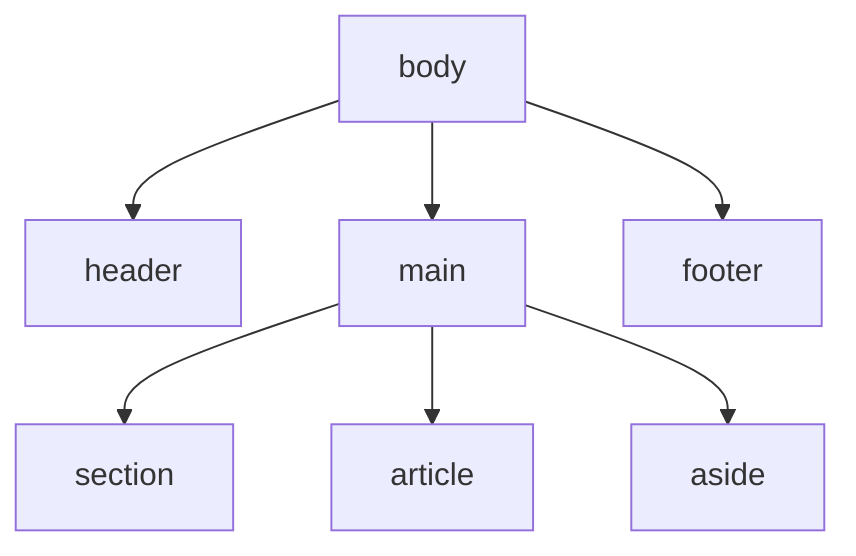
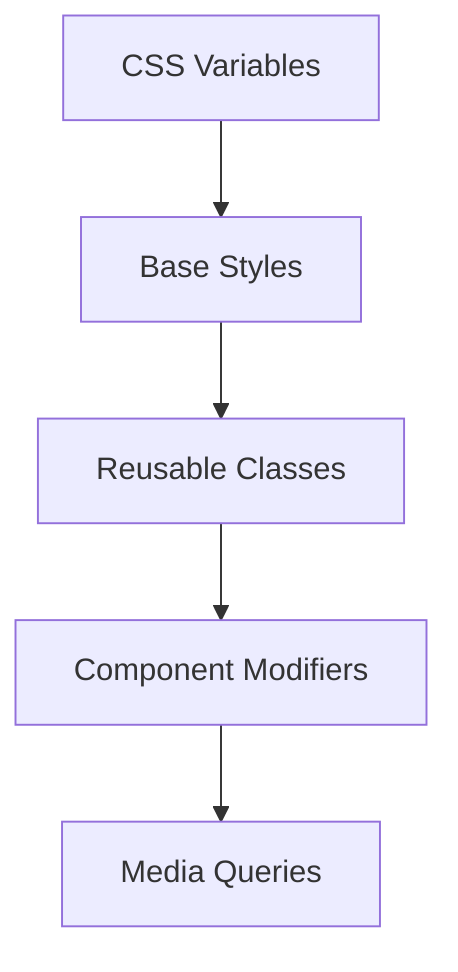

# 🧱 UI Structuring and Best Practices

> **📄 Suggested File Name:** `05_UI_Structuring_and_Best_Practices.md`

<p align="center">


</p>

---

# 📚 Table of Contents

- 📖 Overview
- 🎯 Learning Objectives
- 🧠 Prerequisites
- 🏗 Structuring a Webpage
- 🧩 Reusable Classes & Clean CSS Practices
- 🎯 Basic Design Principles
- ✨ Simple Animations & Transitions
- 💻 Complete Example
- 📊 Mermaid Diagrams
- ⚠ Common Mistakes
- ✅ Best Practices
- 🎤 Interview Questions
- 📝 Practice Questions
- ❓ MCQs
- 📌 Cheat Sheet
- ⚡ Quick Revision
- 📖 Summary
- 📚 References

---

# 📖 Overview

Once you know how to style elements and lay them out with Flexbox and Grid, the next step is learning how to **structure a full page properly** and **write CSS that's clean, reusable, and pleasant to work with**.

This lesson covers:

- 🏗 **Semantic structure** — organizing a page with header, nav, section, footer
- 🧩 **Reusable classes** — writing CSS that scales
- 🎯 **Design principles** — spacing, alignment, consistency
- ✨ **Animations & transitions** — adding simple motion to a UI

---

# 🎯 Learning Objectives

After completing this lesson, you will be able to:

- ✅ Structure a webpage using semantic HTML elements.
- ✅ Write reusable, maintainable CSS classes.
- ✅ Apply basic design principles for a polished layout.
- ✅ Add simple transitions and animations to elements.

---

# 🧠 Prerequisites

- Understanding of CSS box model, display, and positioning
- Familiarity with Flexbox and Grid basics
- VS Code or any text editor
- Web browser

---

# 🏗 Structuring a Webpage

Instead of wrapping everything in generic `<div>` tags, HTML provides **semantic elements** that describe the purpose of each section.

---

## 🏗 Common Semantic Elements

```html
<header>Top of the page — logo, navigation</header>

<nav>Navigation links</nav>

<main>

<section>A distinct section of content</section>

<article>Self-contained piece of content</article>

<aside>Side content, like a sidebar</aside>

</main>

<footer>Bottom of the page — copyright, links</footer>
```

| Element | Purpose |
|----------|----------|
| `<header>` | Introductory content, usually logo + nav |
| `<nav>` | Navigation links |
| `<main>` | Main unique content of the page |
| `<section>` | A thematic grouping of content |
| `<article>` | Independent, self-contained content |
| `<aside>` | Related but secondary content |
| `<footer>` | Closing content, usually credits/links |

---

## 🌍 Why Semantic Structure Matters

- 🔍 Improves **SEO** (search engines understand page structure).
- ♿ Improves **accessibility** (screen readers navigate more easily).
- 🧹 Makes code **easier to read and maintain**.
- 👥 Helps teams understand a layout at a glance.

---

## 🏗 Basic Page Skeleton

```html
<body>

<header class="site-header">

<div class="logo">Brand</div>

<nav class="site-nav">Home | About | Contact</nav>

</header>

<main>

<section class="hero">Welcome Section</section>

<section class="features">Features Section</section>

</main>

<footer class="site-footer">© 2026 Brand. All rights reserved.</footer>

</body>
```

---

# 🧩 Reusable Classes & Clean CSS Practices

Well-organized CSS avoids repetition and stays easy to update.

---

## 🧩 Reusable Utility Classes

Instead of repeating the same styles everywhere, create small reusable classes.

```css
.btn{
    padding: 10px 20px;
    border-radius: 6px;
    border: none;
    cursor: pointer;
}

.btn-primary{
    background-color: #1572B6;
    color: white;
}

.btn-secondary{
    background-color: #eeeeee;
    color: #333333;
}
```

```html
<button class="btn btn-primary">Save</button>

<button class="btn btn-secondary">Cancel</button>
```

The shared `.btn` class holds common styles; modifier classes (`.btn-primary`, `.btn-secondary`) add variations.

---

## 🧹 Clean CSS Naming (BEM-style)

**BEM** = Block, Element, Modifier — a popular naming convention for predictable, reusable classes.

```css
.card{ }          /* Block */

.card__title{ }   /* Element */

.card--highlighted{ }  /* Modifier */
```

```html
<div class="card card--highlighted">

<h3 class="card__title">Title</h3>

</div>
```

---

## 🧩 Grouping & Organizing CSS

```css
/* ===== Variables ===== */

:root{
    --primary-color: #1572B6;
    --spacing-unit: 8px;
}

/* ===== Buttons ===== */

.btn{ }

.btn-primary{ }

/* ===== Cards ===== */

.card{ }

.card__title{ }
```

Using **CSS custom properties** (`--variable-name`) keeps colors, spacing, and fonts consistent and easy to change in one place.

```css
.box{
    background-color: var(--primary-color);
    padding: var(--spacing-unit);
}
```

---

# 🎯 Basic Design Principles

Good CSS structure means little without good visual design judgment.

---

## 📏 Spacing

- Keep spacing **consistent** using a scale (e.g., multiples of 8px: 8, 16, 24, 32).
- Use `margin` for space **between** elements, `padding` for space **inside** them.
- Avoid cramming content — whitespace improves readability.

```css
.section{
    padding: 40px 20px;
}

.section + .section{
    margin-top: 32px;
}
```

---

## 📐 Alignment

- Align related items along a shared edge (left, center, or grid lines).
- Use Flexbox/Grid alignment properties instead of manual margins wherever possible.
- Misaligned elements are one of the fastest ways a design looks unpolished.

```css
.container{
    display: flex;
    align-items: center;
    justify-content: space-between;
}
```

---

## 🎨 Consistency

- Reuse the same colors, fonts, and spacing values across the whole site.
- Define shared values once (via CSS variables or reusable classes) instead of repeating raw values.
- Keep consistent button styles, heading sizes, and spacing patterns across all pages.

---

## 📊 Design Principles at a Glance

| Principle | Goal |
|------------|------|
| Spacing | Consistent whitespace, not cramped or scattered |
| Alignment | Elements line up predictably |
| Consistency | Same colors/fonts/spacing reused throughout |

---

# ✨ Simple Animations & Transitions

Small motion effects make an interface feel more responsive and polished.

---

## ✨ transition Property

`transition` smoothly animates a property change (like `hover` effects) instead of it happening instantly.

```css
.btn{
    background-color: #1572B6;
    transition: background-color 0.3s ease;
}

.btn:hover{
    background-color: #0d5a8f;
}
```

| Part | Example | Purpose |
|-------|----------|----------|
| Property | `background-color` | What to animate |
| Duration | `0.3s` | How long it takes |
| Timing function | `ease` | Speed curve of the animation |

---

## 📊 Common Timing Functions

| Value | Behavior |
|--------|-----------|
| linear | Constant speed |
| ease | Slow start, fast middle, slow end (default feel) |
| ease-in | Starts slow |
| ease-out | Ends slow |
| ease-in-out | Slow start and end |

---

## 🎞 @keyframes Animation

For more complex, multi-step animations, use `@keyframes`.

```css
@keyframes fadeIn{
    from{
        opacity: 0;
    }
    to{
        opacity: 1;
    }
}

.card{
    animation: fadeIn 0.6s ease-in;
}
```

---

## 📊 transition vs animation

| Feature | transition | animation |
|----------|-------------|-----------|
| Trigger | Needs a state change (e.g. `:hover`) | Runs automatically or on class add |
| Steps | Start → End only | Multiple steps via `@keyframes` |
| Complexity | Simple | More flexible/complex |

---

# 💻 Complete Example

### index.html

```html
<!DOCTYPE html>

<html>

<head>

<title>UI Structure Example</title>

<link rel="stylesheet" href="style.css">

</head>

<body>

<header class="site-header">

<div class="logo">Brand</div>

<nav class="site-nav">Home | About | Contact</nav>

</header>

<main>

<section class="hero">

<h1 class="hero__title">Welcome</h1>

<button class="btn btn-primary">Get Started</button>

</section>

</main>

<footer class="site-footer">© 2026 Brand</footer>

</body>

</html>
```

---

### style.css

```css
:root{
    --primary-color: #1572B6;
    --spacing-unit: 8px;
}

body{
    margin: 0;
    font-family: Arial, sans-serif;
}

.site-header{
    display: flex;
    justify-content: space-between;
    align-items: center;
    padding: calc(var(--spacing-unit) * 2) calc(var(--spacing-unit) * 3);
    background-color: var(--primary-color);
    color: white;
}

.hero{
    text-align: center;
    padding: calc(var(--spacing-unit) * 8) calc(var(--spacing-unit) * 2);
    animation: fadeIn 0.6s ease-in;
}

.btn{
    padding: 10px 20px;
    border: none;
    border-radius: 6px;
    cursor: pointer;
    transition: background-color 0.3s ease;
}

.btn-primary{
    background-color: var(--primary-color);
    color: white;
}

.btn-primary:hover{
    background-color: #0d5a8f;
}

.site-footer{
    text-align: center;
    padding: calc(var(--spacing-unit) * 2);
    background-color: #eeeeee;
}

@keyframes fadeIn{
    from{ opacity: 0; }
    to{ opacity: 1; }
}
```

---

# 📊 Mermaid Diagrams

### Semantic Page Structure



### CSS Organization Flow



---

# ⚠ Common Mistakes

- ❌ Using `<div>` for everything instead of semantic tags like `<header>`, `<nav>`, `<footer>`.
- ❌ Writing one-off styles repeatedly instead of creating a reusable class.
- ❌ Inconsistent spacing values scattered across the CSS file (e.g. 7px, 13px, 22px).
- ❌ Overusing animations, which can distract instead of enhance.
- ❌ Forgetting `transition` on the base state, causing hover changes to snap instead of animate.
- ❌ Deeply nested, overly specific class names that are hard to reuse.

---

# ✅ Best Practices

- Use semantic HTML elements to structure the page logically.
- Build small, reusable classes (like `.btn`, `.card`) instead of repeating styles.
- Use CSS custom properties (`--variables`) for colors and spacing.
- Follow a consistent spacing scale (e.g. multiples of 8px).
- Align elements using Flexbox/Grid rather than manual guesswork.
- Keep animations subtle and purposeful — used to guide attention, not distract.
- Group and comment CSS sections for readability.

---

# 🎤 Interview Questions

### Beginner

1. What is semantic HTML, and why does it matter?
2. What is the purpose of `<header>`, `<nav>`, and `<footer>`?
3. What is a reusable CSS class?
4. What does the `transition` property do?

---

### Intermediate

5. What is BEM naming convention, and why is it useful?
6. What are CSS custom properties (variables), and how are they used?
7. What's the difference between `transition` and `animation`?
8. Why is consistent spacing important in UI design?

---

### Advanced

9. How would you structure CSS in a large project to keep it maintainable?
10. When would you choose `@keyframes` animation over a simple `transition`?

---

# 📝 Practice Questions

### 🟢 Easy

- Structure a webpage using `<header>`, `<main>`, and `<footer>`.
- Create a reusable `.btn` class with two color variants.
- Add a hover `transition` to a button's background color.

---

### 🟡 Medium

- Refactor repeated CSS declarations into a shared reusable class.
- Define CSS variables for a color palette and spacing scale, then use them throughout a page.
- Create a fade-in animation for a section using `@keyframes`.

---

### 🔴 Hard

Create a webpage with:

- Full semantic structure (header, nav, main, section, article, aside, footer)
- BEM-style reusable classes for at least one component
- Consistent spacing using CSS variables
- A hover transition on buttons and a fade-in animation on page load

---

# ❓ MCQs

### 1. Which semantic element represents the main navigation links?

- A. `<section>`
- B. `<nav>` ✅
- C. `<aside>`
- D. `<article>`

---

### 2. In BEM naming, what does the double underscore (`__`) represent?

- A. A modifier
- B. A block
- C. An element ✅
- D. A pseudo-class

---

### 3. Which CSS feature lets you define a reusable value like a color across a stylesheet?

- A. `@media`
- B. Custom properties (`--variable`) ✅
- C. `!important`
- D. `@keyframes`

---

### 4. Which property smoothly animates a property change on hover?

- A. animation
- B. transform
- C. transition ✅
- D. transition-none

---

### 5. Which rule defines multi-step animation sequences?

- A. `@transition`
- B. `@keyframes` ✅
- C. `@steps`
- D. `@animate`

---

# 📌 Cheat Sheet

| Concept | Syntax |
|----------|--------|
| Header | `<header></header>` |
| Navigation | `<nav></nav>` |
| Section | `<section></section>` |
| Footer | `<footer></footer>` |
| Reusable class | `.btn { }` |
| Modifier class (BEM) | `.block--modifier` |
| Element class (BEM) | `.block__element` |
| CSS variable define | `--name: value;` (inside `:root`) |
| CSS variable use | `var(--name)` |
| Transition | `transition: property duration timing;` |
| Keyframe animation | `@keyframes name { from{} to{} }` |
| Apply animation | `animation: name duration timing;` |

---

# ⚡ Quick Revision

```text
🏗 Semantic Tags → header, nav, main, section, article, aside, footer

🧩 Reusable Classes → .btn, .card (avoid repeating styles)

🧹 BEM → Block__Element--Modifier

🎨 CSS Variables → --name: value; / var(--name)

📏 Spacing → consistent scale (8px, 16px, 24px...)

📐 Alignment → use Flexbox/Grid, not manual margins

🎯 Consistency → same colors, fonts, spacing everywhere

✨ transition → smooth change on state change (e.g. hover)

🎞 @keyframes → multi-step animation sequences
```

---

# 📖 Summary

Good UI structuring goes beyond styling individual elements — it's about organizing a page logically with semantic HTML (header, nav, section, footer), writing CSS that's reusable and easy to maintain through classes and CSS variables, and applying core design principles like consistent spacing, clear alignment, and visual consistency. Simple transitions and `@keyframes` animations add polish and responsiveness to an interface without overwhelming the user. Together, these practices turn a functional page into a clean, professional, and maintainable UI.

---

# 📚 References

- https://developer.mozilla.org/en-US/docs/Web/HTML/Element/header
- https://developer.mozilla.org/en-US/docs/Glossary/Semantics
- https://developer.mozilla.org/en-US/docs/Web/CSS/CSS_transitions
- https://developer.mozilla.org/en-US/docs/Web/CSS/@keyframes
- https://getbem.com/
- https://developer.mozilla.org/en-US/docs/Web/CSS/Using_CSS_custom_properties
