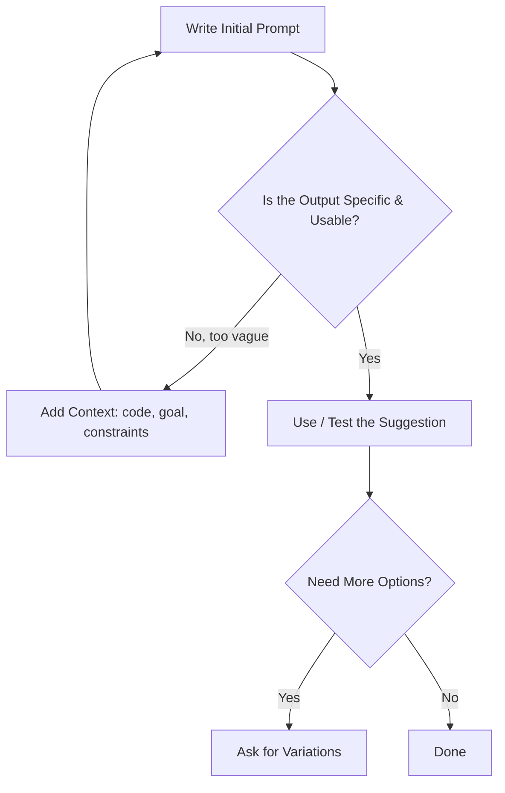

# 🤖 Assisted Learning with AI

> **📄 Suggested File Name:** `06_Assisted_Learning.md`

<p align="center">


</p>

---

# 📚 Table of Contents

- 📖 Overview
- 🎯 Learning Objectives
- 🧠 Prerequisites
- 🤖 Using ChatGPT for HTML/CSS Explanations
- 🎨 Using ChatGPT for Layout Ideas
- 🛠 Prompt Refinement (Basic)
- 🎲 Asking for Variations (UI Ideas)
- 🔍 Identifying Vague Outputs
- 💻 Example Prompt Walkthrough
- 📊 Mermaid Diagram
- ⚠ Common Mistakes
- ✅ Best Practices
- 🎤 Interview Questions
- 📝 Practice Questions
- ❓ MCQs
- 📌 Cheat Sheet
- ⚡ Quick Revision
- 📖 Summary
- 📚 References

---

# 📖 Overview

AI chat tools like **ChatGPT** can be powerful learning companions for HTML/CSS — but only when used thoughtfully.

This lesson is about **how to use AI well**, not just what to ask. It covers:

- 🤖 Getting clear explanations of HTML/CSS concepts
- 🎨 Brainstorming layout and UI ideas
- 🛠 Refining prompts to get better answers
- 🎲 Asking for multiple variations
- 🔍 Spotting vague or unhelpful outputs so you can fix the prompt

---

# 🎯 Learning Objectives

After completing this lesson, you will be able to:

- ✅ Use ChatGPT to get clear explanations of HTML/CSS concepts.
- ✅ Ask for layout ideas in a way that produces usable suggestions.
- ✅ Refine a basic prompt into a more specific, useful one.
- ✅ Request multiple UI variations from a single idea.
- ✅ Recognize vague AI outputs and know how to improve them.

---

# 🧠 Prerequisites

- Basic knowledge of HTML and CSS
- Access to an AI chat tool (e.g. ChatGPT)
- A code editor to test generated code

---

# 🤖 Using ChatGPT for HTML/CSS Explanations

AI tools are useful for breaking down concepts in plain language, especially when documentation feels too technical.

---

## 🤖 Good Explanation Prompts

```text
Explain the CSS box model like I'm a complete beginner, with a simple example.
```

```text
What's the difference between "position: relative" and "position: absolute"? Give a short code example for each.
```

```text
Why does my flex item not respect "width" when display is "inline"?
```

---

## 📊 What Makes These Prompts Work

| Element | Why It Helps |
|----------|----------------|
| States the exact concept | AI doesn't have to guess what you mean |
| Mentions your level | Answer is pitched appropriately (beginner vs advanced) |
| Asks for an example | Turns an abstract answer into something concrete |

---

# 🎨 Using ChatGPT for Layout Ideas

AI can act as a **brainstorming partner** for how to structure a page, not just explain syntax.

---

## 🎨 Good Layout Prompts

```text
Suggest 3 different layout ideas for a portfolio homepage with a hero section, projects grid, and contact form.
```

```text
I have a header, sidebar, and main content area. Suggest a CSS Grid layout for this using grid-template-areas.
```

```text
What's a clean way to lay out a pricing page with 3 plan cards side by side, responsive on mobile?
```

---

## 📊 Explanation vs Layout Prompts

| Prompt Type | Goal | Example Keyword |
|---------------|------|-------------------|
| Explanation | Understand *why*/*how* something works | "explain", "why", "difference between" |
| Layout Idea | Get structural/design suggestions | "suggest", "layout for", "structure" |

---

# 🛠 Prompt Refinement (Basic)

The first prompt you write is rarely the best one. Refining means adding detail step by step.

---

## 🛠 Refinement Example

**Vague:**

```text
Make my website look better.
```

**Refined:**

```text
My landing page has a header, a hero section, and 3 feature cards. The colors feel flat. Suggest a color palette and font pairing that feels modern and professional.
```

---

## 🛠 Refinement Checklist

When refining a prompt, try adding:

- 📌 What you already have (current structure/code)
- 🎯 What specifically feels wrong or missing
- 🎨 The tone/style you want (modern, minimal, playful, corporate)
- 📱 Any constraints (must be responsive, no JavaScript, etc.)

---

## 📊 Before vs After Refinement

| Vague Prompt | Refined Prompt |
|----------------|------------------|
| "Fix my CSS" | "My flex items overlap on mobile — here's my CSS, what's causing it?" |
| "Make a button" | "Give me CSS for a rounded primary button with a hover transition, matching a blue (#1572B6) theme" |
| "Improve my layout" | "My 3-column grid doesn't collapse on mobile — suggest a media query fix" |

---

# 🎲 Asking for Variations (UI Ideas)

Instead of accepting the first answer, ask for **alternatives** to compare.

---

## 🎲 Variation Prompts

```text
Give me 3 different button style variations (rounded, outlined, and gradient) with CSS for each.
```

```text
Show me 2 different navbar layouts: one centered logo, one logo-left/links-right.
```

```text
Suggest 3 color palette options for a minimalist blog design.
```

---

## 🎲 Why Ask for Variations

- Helps you **compare options** instead of settling on the first idea.
- Reveals design possibilities you might not have considered.
- Makes it easier to mix and match elements from different suggestions.

---

# 🔍 Identifying Vague Outputs

Not every AI response is equally useful. Learning to spot a vague answer is as important as writing a good prompt.

---

## 🔍 Signs of a Vague Output

| Sign | Example |
|-------|----------|
| Generic advice with no code | "Just make sure your layout is responsive and looks clean." |
| No specifics or measurements | "Add some spacing between the elements." |
| Doesn't reference your actual code/context | Ignores the HTML/CSS you shared |
| Overly broad suggestions | "Use best practices for accessibility." (without saying which) |

---

## 🔍 Turning a Vague Output into a Useful One

If the AI gives a vague answer, respond with a **follow-up** that narrows it down:

```text
That's too general — can you give me the exact CSS values to use, based on the code I shared?
```

```text
Can you show this as actual code instead of describing it?
```

```text
Be specific: which property and pixel value would fix the spacing issue?
```

---

# 💻 Example Prompt Walkthrough

### ❌ Vague Prompt

```text
Help me with my navbar.
```

### 🟡 Slightly Better

```text
My navbar looks broken on mobile. Help me fix it.
```

### ✅ Well-Refined Prompt

```text
Here's my navbar HTML and CSS. On screens under 768px, the links overflow instead of stacking. 
Suggest a media query fix that stacks the links vertically and keeps the logo centered.
```

### 📊 Result Quality

| Prompt Version | Likely Output |
|------------------|------------------|
| Vague | Generic tips, no code |
| Slightly better | General mobile-nav advice, maybe partial code |
| Well-refined | Specific, usable CSS with a media query fix |

---

# 📊 Mermaid Diagram

### Prompt Refinement Flow



---

# ⚠ Common Mistakes

- ❌ Asking overly broad questions like "make this better" without context.
- ❌ Not sharing your actual code, forcing the AI to guess your setup.
- ❌ Accepting the first answer without asking for alternatives.
- ❌ Not specifying constraints (responsive, no JS, specific colors), leading to unusable suggestions.
- ❌ Treating vague answers as final instead of asking a sharper follow-up.
- ❌ Copy-pasting generated code without understanding what it does.

---

# ✅ Best Practices

- Always describe **what you already have** before asking for changes.
- State your **goal** and any **constraints** clearly.
- Ask for **code examples**, not just descriptions.
- Request **multiple variations** before settling on one approach.
- If an answer feels vague, **ask a sharper follow-up** instead of giving up.
- Test any generated code yourself — understand it before using it.

---

# 🎤 Interview Questions

### Beginner

1. What is prompt refinement?
2. Give an example of a vague prompt and a refined version of it.
3. Why is it useful to ask an AI tool for layout variations?
4. What makes an AI output "vague"?

---

### Intermediate

5. What details should you include when asking AI to fix a layout bug?
6. How would you turn a vague AI response into a more useful one?
7. What's the difference between asking for an "explanation" vs a "layout idea"?

---

### Advanced

8. Why is sharing your actual code important when asking for help with CSS issues?
9. How can asking for multiple variations improve a design decision process?

---

# 📝 Practice Questions

### 🟢 Easy

- Write a vague prompt, then rewrite it as a refined one.
- Ask an AI tool to explain a single CSS property in beginner terms.
- Ask for 2 button style variations.

---

### 🟡 Medium

- Share a broken layout snippet and ask for a specific fix.
- Ask for 3 layout ideas for the same webpage section.
- Identify a vague AI response and write a sharper follow-up prompt.

---

### 🔴 Hard

Practice a full refinement cycle:

- Start with a vague prompt about a layout problem.
- Refine it at least twice, adding context each time.
- Ask for 2–3 variations of the final solution.
- Identify which output is most specific and usable, and explain why.

---

# ❓ MCQs

### 1. Which of these is the most refined prompt?

- A. "Fix my website"
- B. "Make it responsive"
- C. "My 3-column grid doesn't collapse below 600px — here's my CSS, what's wrong?" ✅
- D. "Improve the layout"

---

### 2. What is a common sign of a vague AI output?

- A. Includes exact CSS values
- B. References your shared code
- C. Gives generic advice with no code ✅
- D. Offers multiple options

---

### 3. Why ask for UI variations instead of accepting the first idea?

- A. It wastes time
- B. It helps compare options before deciding ✅
- C. It's required by the AI tool
- D. It guarantees the best design

---

### 4. What should you add to a prompt when refining it?

- A. Less detail
- B. Context, goal, and constraints ✅
- C. Random keywords
- D. Nothing, first prompts are always best

---

# 📌 Cheat Sheet

| Concept | Example |
|----------|----------|
| Explanation prompt | "Explain [concept] simply, with an example." |
| Layout idea prompt | "Suggest layout options for [page section]." |
| Refinement addition | Current code + goal + constraints |
| Variation prompt | "Give me 3 different versions of [element]." |
| Vague-output follow-up | "Be specific — give exact code/values." |

---

# ⚡ Quick Revision

```text
🤖 Explanations → ask concept + level + example

🎨 Layout Ideas → ask "suggest layout for..."

🛠 Refinement → add code, goal, constraints

🎲 Variations → ask for 2-3 options, compare

🔍 Vague Output Signs → generic, no code, ignores your context

🔍 Fix Vague Output → follow up asking for specifics
```

---

# 📖 Summary

AI tools like ChatGPT can accelerate HTML/CSS learning when used with intention — asking clear, context-rich questions for explanations and layout ideas, refining prompts by adding your current code, goals, and constraints, and requesting multiple variations before settling on a design. Just as important is learning to recognize a vague, generic response and knowing how to follow up for something specific and usable. Treated as a thinking partner rather than an answer machine, AI becomes a genuinely useful part of the learning process.

---

# 📚 References

- https://developer.mozilla.org/en-US/docs/Web
- https://www.w3schools.com/css/
- https://css-tricks.com/
- https://help.openai.com/en/articles/6654000-best-practices-for-prompt-engineering-with-the-openai-api
