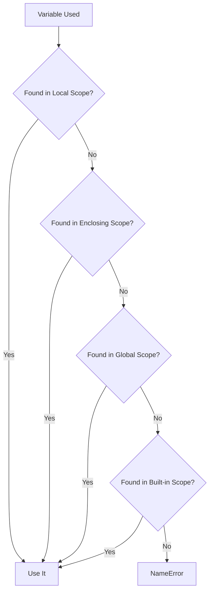
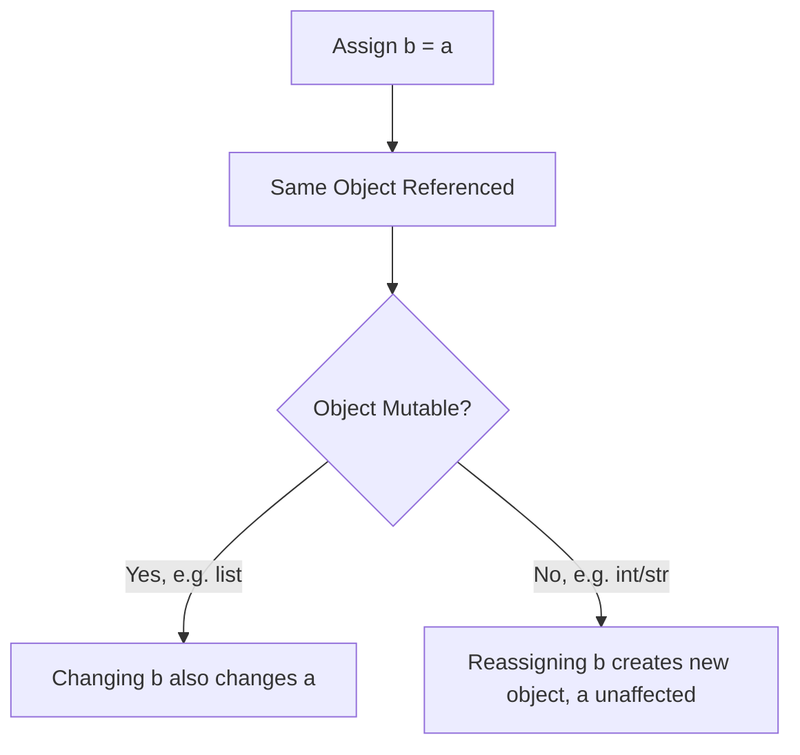

# 🐍 Python Fundamentals: Scope, Mutability & Memory

> **📄 Suggested File Name:** `07_Python_Scope_Mutability_Memory.md`

<p align="center">


</p>

---

# 📚 Table of Contents

- 📖 Overview
- 🎯 Learning Objectives
- 🧠 Prerequisites
- 🗂 Scope and Variable Lifetime
- 🔄 Mutable vs Immutable Behavior
- 🔗 Reference Behavior in Python
- ⚙ Execution Flow and Memory Basics
- 💻 Complete Example
- 📊 Mermaid Diagrams
- ⚠ Common Mistakes
- ✅ Best Practices
- 🎤 Interview Questions
- 📝 Practice Questions
- ❓ MCQs
- 📌 Cheat Sheet
- ⚡ Quick Revision
- 📖 Summary
- 📚 References

---

# 📖 Overview

To really understand Python — not just write it — you need to know **where variables live**, **how long they last**, **whether changing one value affects another**, and **what happens in memory** as code runs.

This lesson covers:

- 🗂 **Scope** — where a variable can be accessed
- 🔄 **Mutability** — whether a value can change in place
- 🔗 **References** — how variables actually point to objects
- ⚙ **Execution flow & memory** — how Python runs code step by step

---

# 🎯 Learning Objectives

After completing this lesson, you will be able to:

- ✅ Explain local, global, and enclosing scope.
- ✅ Predict a variable's lifetime based on where it's defined.
- ✅ Distinguish mutable and immutable types and their behavior.
- ✅ Understand how references work when passing variables around.
- ✅ Trace basic execution flow and memory allocation in Python.

---

# 🧠 Prerequisites

- Basic Python syntax (variables, functions, loops)
- A Python interpreter (e.g. Python 3.10+, IDLE, or VS Code)

---

# 🗂 Scope and Variable Lifetime

**Scope** determines *where* in your code a variable can be accessed. **Lifetime** determines *how long* it exists in memory.

---

## 🗂 The Three Main Scopes (LEGB Rule)

Python resolves variable names using the **LEGB** rule:

```
Local → Enclosing → Global → Built-in
```

| Scope | Description |
|--------|-------------|
| Local | Inside the current function |
| Enclosing | Inside an outer (enclosing) function, for nested functions |
| Global | Defined at the top level of a module |
| Built-in | Provided by Python itself (e.g. `len`, `print`) |

---

## 🗂 Local Scope

```python
def greet():
    message = "Hello"   # local variable
    print(message)

greet()
print(message)   # ❌ NameError: message is not defined here
```

`message` only exists **inside** `greet()`. Once the function finishes, it's gone.

---

## 🗂 Global Scope

```python
name = "Python"   # global variable

def show_name():
    print(name)   # can read the global variable

show_name()
```

Functions can **read** global variables freely, but modifying them requires the `global` keyword.

```python
counter = 0

def increment():
    global counter
    counter += 1

increment()
print(counter)   # 1
```

---

## 🗂 Enclosing Scope (Nested Functions)

```python
def outer():
    message = "Hi"

    def inner():
        print(message)   # reads from enclosing scope

    inner()

outer()
```

To **modify** an enclosing variable from a nested function, use `nonlocal`.

```python
def outer():
    count = 0

    def inner():
        nonlocal count
        count += 1

    inner()
    print(count)   # 1

outer()
```

---

## ⏳ Variable Lifetime

- A **local** variable's lifetime ends when the function returns.
- A **global** variable lives as long as the program/module is running.
- Python automatically removes objects from memory when nothing references them anymore (**garbage collection**).

---

# 🔄 Mutable vs Immutable Behavior

Every value in Python is an **object**, and every object is either **mutable** (can change in place) or **immutable** (cannot).

---

## 📊 Mutable vs Immutable Types

| Type | Mutable? |
|-------|-----------|
| int | ❌ Immutable |
| float | ❌ Immutable |
| str | ❌ Immutable |
| tuple | ❌ Immutable |
| bool | ❌ Immutable |
| list | ✅ Mutable |
| dict | ✅ Mutable |
| set | ✅ Mutable |

---

## 🔄 Immutable Example

```python
x = "hello"
y = x
x = x + " world"

print(x)   # hello world
print(y)   # hello   (unchanged)
```

Strings can't be changed in place — `x + " world"` creates a **new** string object; `y` still points to the original.

---

## 🔄 Mutable Example

```python
list_a = [1, 2, 3]
list_b = list_a
list_a.append(4)

print(list_a)   # [1, 2, 3, 4]
print(list_b)   # [1, 2, 3, 4]  ← changed too!
```

Since `list_b` points to the **same list object** as `list_a`, modifying one affects the other.

---

## 📊 Why This Matters

| Behavior | Immutable | Mutable |
|-----------|------------|----------|
| Reassignment | Creates a new object | Same object stays |
| Passed to a function | Original stays unaffected | Original can be changed inside the function |
| Safe to share across variables | ✅ Always safe | ⚠ Only if changes are intended |

---

# 🔗 Reference Behavior in Python

In Python, **variables are names bound to objects in memory** — not boxes holding values directly.

---

## 🔗 Variables as Labels

```python
a = [1, 2, 3]
b = a
```

Both `a` and `b` are labels pointing to the **same list object** in memory — not two separate copies.

```
a ──┐
    ├──► [1, 2, 3]
b ──┘
```

---

## 🔗 Checking Identity with `id()` and `is`

```python
a = [1, 2, 3]
b = a

print(id(a) == id(b))   # True
print(a is b)            # True
```

`is` checks whether two variables reference the **same object in memory**, while `==` checks whether their **values** are equal.

---

## 🔗 Function Arguments and References

```python
def add_item(lst):
    lst.append("new")

my_list = ["a", "b"]
add_item(my_list)

print(my_list)   # ['a', 'b', 'new']
```

Because `lst` inside the function refers to the **same list object**, the change is visible outside the function too.

```python
def try_change(x):
    x = x + 1

num = 5
try_change(num)

print(num)   # 5 (unchanged)
```

Here, `x + 1` creates a **new** integer object; `num` outside is untouched — because integers are immutable.

---

## 🔗 Copying to Avoid Shared References

```python
original = [1, 2, 3]
copy_ = original.copy()

copy_.append(4)

print(original)   # [1, 2, 3]
print(copy_)      # [1, 2, 3, 4]
```

Using `.copy()` (or `list()`, `dict()`, slicing `[:]`) creates a **new** object instead of sharing the same reference.

---

# ⚙ Execution Flow and Memory Basics

Understanding how Python **runs** code line by line — and how it manages memory — helps explain scope and mutability.

---

## ⚙ How Python Executes Code

1. Python reads code **top to bottom**, line by line.
2. Function **definitions** are stored but not run until **called**.
3. Each function call creates its own **stack frame** — a fresh space for local variables.
4. When the function returns, its stack frame is destroyed (locals disappear).

```python
def add(a, b):
    return a + b

result = add(2, 3)   # function call creates a stack frame
print(result)
```

---

## ⚙ Call Stack Basics

```
Call add(2, 3)
      │
      ▼
New stack frame created: a = 2, b = 3
      │
      ▼
Function runs, returns 5
      │
      ▼
Stack frame destroyed
      │
      ▼
result = 5
```

---

## 🧠 Memory: Stack vs Heap (Conceptual)

| Memory Area | Stores | Lifetime |
|--------------|---------|-----------|
| Stack | Function calls, local variable *references* | Cleared when function returns |
| Heap | Actual objects (lists, dicts, strings, etc.) | Lives until no references remain (garbage collected) |

> Variable names live on the stack (as references); the actual objects they point to live on the heap.

---

## 🧠 Garbage Collection

```python
def create_list():
    temp = [1, 2, 3]   # created on the heap
    return None

create_list()
# temp's reference is gone once the function returns
# Python's garbage collector frees the list object from memory
```

Python automatically frees memory for objects once **nothing references them anymore**.

---

# 💻 Complete Example

```python
counter = 0   # global scope

def process(data):
    global counter
    counter += 1          # modifies global variable

    local_copy = data.copy()   # avoids shared reference
    local_copy.append("processed")

    return local_copy

original_data = ["item1", "item2"]
result = process(original_data)

print("Original:", original_data)   # unaffected
print("Result:", result)            # has "processed" added
print("Counter:", counter)          # 1
```

### 🔍 What's Happening

- `counter` is global, modified using the `global` keyword.
- `data` inside `process()` is a **reference** to `original_data`.
- `.copy()` prevents the mutation from affecting the original list.
- Once `process()` returns, its local stack frame (including `data`, `local_copy`) is destroyed.

---

# 📊 Mermaid Diagrams

### Scope Resolution (LEGB)



### Reference vs Copy



---

# ⚠ Common Mistakes

- ❌ Trying to modify a global variable inside a function without the `global` keyword.
- ❌ Assuming `b = a` creates a copy of a mutable object (it creates a shared reference).
- ❌ Confusing `==` (value equality) with `is` (identity/reference equality).
- ❌ Passing a mutable list/dict into a function and being surprised the original changes.
- ❌ Forgetting that immutable objects (int, str, tuple) never change in place — operations create new objects.
- ❌ Assuming variables "store" values directly rather than referencing objects.

---

# ✅ Best Practices

- Keep variables in the **smallest scope** that needs them (prefer local over global).
- Use `global`/`nonlocal` sparingly — excessive shared state makes code harder to reason about.
- When you need an independent copy of a mutable object, use `.copy()`, slicing, or `copy.deepcopy()` for nested structures.
- Use `is` only for identity checks (e.g. `is None`), and `==` for value comparisons.
- Be intentional when passing mutable objects into functions — document if a function mutates its input.
- Use `id()` when debugging reference-related confusion.

---

# 🎤 Interview Questions

### Beginner

1. What is variable scope in Python?
2. What is the difference between local and global scope?
3. Name two mutable and two immutable Python types.
4. What does the `global` keyword do?

---

### Intermediate

5. What is the LEGB rule?
6. What's the difference between `is` and `==`?
7. Why does modifying a list inside a function affect the original list outside it?
8. What is the purpose of the `nonlocal` keyword?

---

### Advanced

9. Explain how Python's stack and heap relate to function calls and object storage.
10. Why does reassigning an immutable variable inside a function not affect the caller's variable, while mutating a mutable one does?

---

# 📝 Practice Questions

### 🟢 Easy

- Write a function with a local variable and try to access it outside — observe the error.
- Create two variables pointing to the same list, modify one, and observe both.
- Use `is` to check whether two variables reference the same object.

---

### 🟡 Medium

- Write a function that modifies a global counter using the `global` keyword.
- Demonstrate the difference between passing a mutable list vs an immutable integer into a function.
- Use `.copy()` to prevent a function from mutating the caller's original list.

---

### 🔴 Hard

Write a program that:

- Uses nested functions with `nonlocal` to maintain a running total
- Demonstrates a case where mutability causes an unintended side effect
- Fixes that side effect using a copy
- Includes comments explaining scope, reference behavior, and memory implications at each step

---

# ❓ MCQs

### 1. What does the LEGB rule stand for?

- A. Local, External, Global, Built-in
- B. Local, Enclosing, Global, Built-in ✅
- C. Local, Enclosing, General, Basic
- D. Loop, Enclosing, Global, Block

---

### 2. Which of these types is mutable?

- A. tuple
- B. str
- C. list ✅
- D. int

---

### 3. What does `a is b` check?

- A. Whether values are equal
- B. Whether both reference the same object ✅
- C. Whether both are the same data type
- D. Whether `a` is greater than `b`

---

### 4. What keyword allows a nested function to modify a variable in its enclosing function?

- A. global
- B. nonlocal ✅
- C. local
- D. static

---

### 5. What happens when you reassign an immutable variable inside a function?

- A. The original object is mutated
- B. A new object is created; the caller's variable is unaffected ✅
- C. It throws an error
- D. Nothing happens

---

# 📌 Cheat Sheet

| Concept | Syntax / Rule |
|----------|----------------|
| Local scope | Variable defined inside a function |
| Global scope | Variable defined at module level |
| Modify global inside function | `global var_name` |
| Modify enclosing inside nested function | `nonlocal var_name` |
| Immutable types | int, float, str, tuple, bool |
| Mutable types | list, dict, set |
| Identity check | `a is b` |
| Value check | `a == b` |
| Copy a list | `new = old.copy()` or `old[:]` |
| Deep copy nested structures | `copy.deepcopy(old)` |
| Object memory ID | `id(obj)` |

---

# ⚡ Quick Revision

```text
🗂 Scope → Local, Enclosing, Global, Built-in (LEGB)

⏳ Lifetime → Local dies when function returns; Global lives with the program

🔄 Immutable → int, float, str, tuple (new object on change)

🔄 Mutable → list, dict, set (changed in place)

🔗 Variables → labels pointing to objects, not boxes holding values

🔗 is → same object   |   == → same value

⚙ Execution → top to bottom, function calls create stack frames

🧠 Stack → references/local vars   |   Heap → actual objects

🧠 Garbage Collection → frees objects with no remaining references
```

---

# 📖 Summary

Understanding scope, mutability, references, and memory is what separates writing Python code from truly understanding it. Scope (governed by the LEGB rule) determines where a variable can be seen and how long it lives, while mutability determines whether a value changes in place or produces a new object when modified. Because Python variables are references to objects rather than the objects themselves, assigning one variable to another can share the same underlying object — which matters enormously for mutable types like lists and dicts. Underneath it all, Python's execution model uses stack frames for function calls and a heap for actual objects, with garbage collection cleaning up memory once nothing references an object anymore. Together, these concepts explain many of Python's most commonly misunderstood behaviors.

---

# 📚 References

- https://docs.python.org/3/reference/executionmodel.html
- https://docs.python.org/3/reference/datamodel.html
- https://docs.python.org/3/library/copy.html
- https://realpython.com/python-scope/
- https://realpython.com/pointers-in-python/
